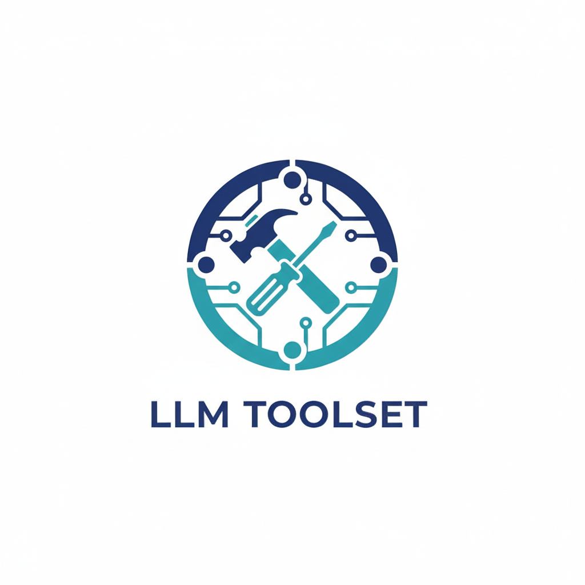

<p align="center">

</p>
<h3 align="center">
Practical toolkit for LLM studies
</h3>
<p align="center">
[](https://pypi.org/project/llm-study) [](https://github.com/QwenLM/Qwen3-Coder)
</p>
---

## Installation
To install LLM Toolset, ensure you have Python 3.9 or higher installed, then run the following command:
```bash
pip install llm-study
```

## Dependencies
LLM Toolset depends on the following libraries:
- transformers (version >= 4.50.0)

### Example: kvcache calculator
`kv_calc.py` provides basic key-value calculation functionalities.
```python
from llm_toolset.kv_calc import calculate_key_value

result = calculate_key_value(data)
```
or use in shell
```bash
$ python -m llm_study.kv_calc -h
```

## Links
- [Homepage](https://github.com/WilliamBy/llm_utils)
- [Issue Tracker](https://github.com/WilliamBy/llm_utils/issues)
